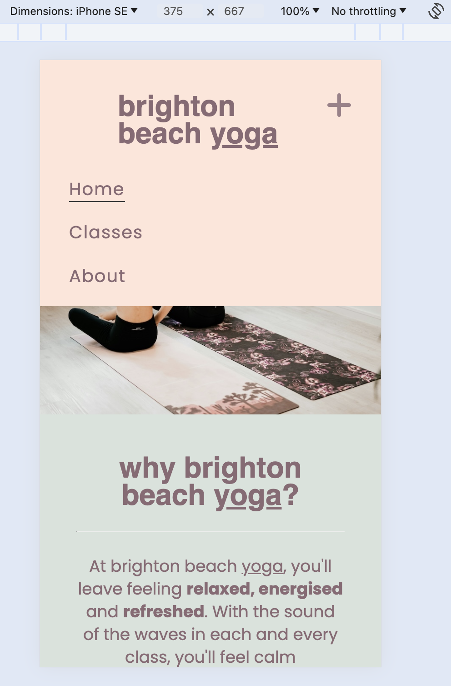
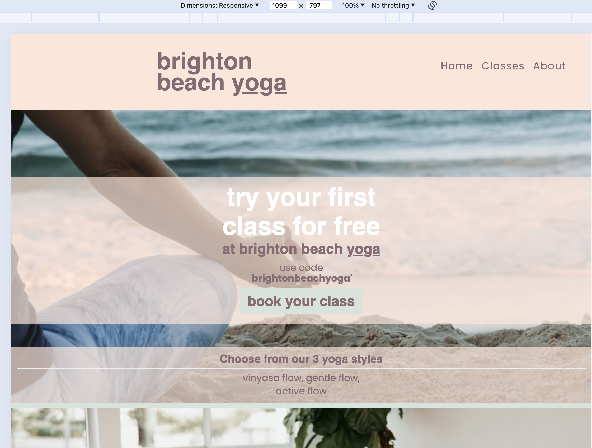
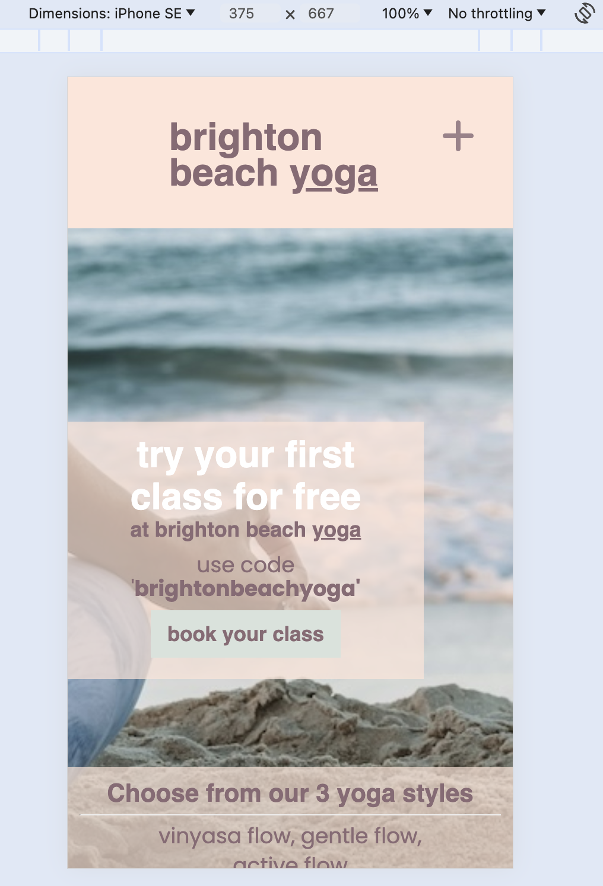
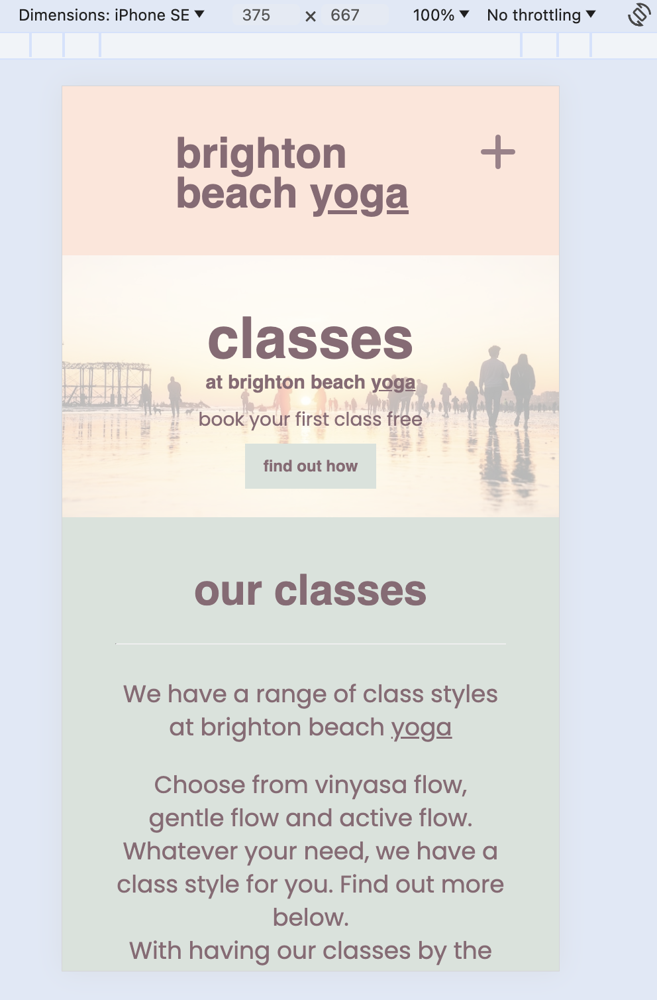
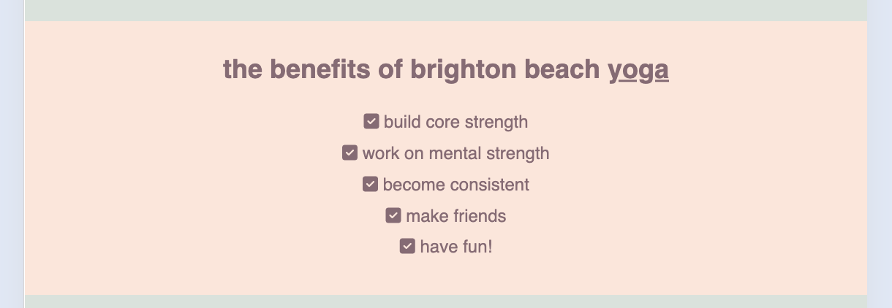
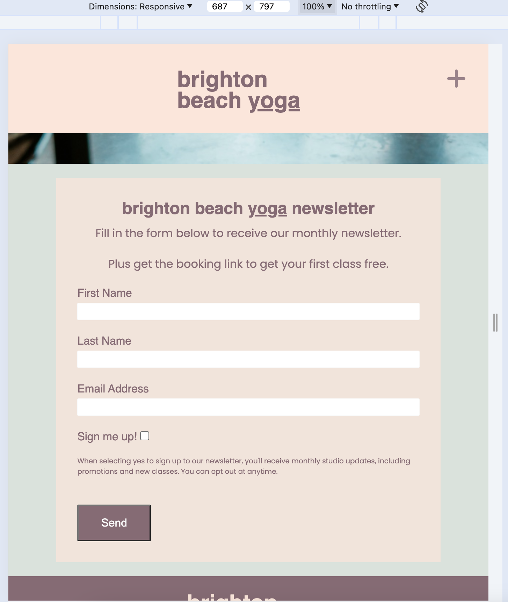
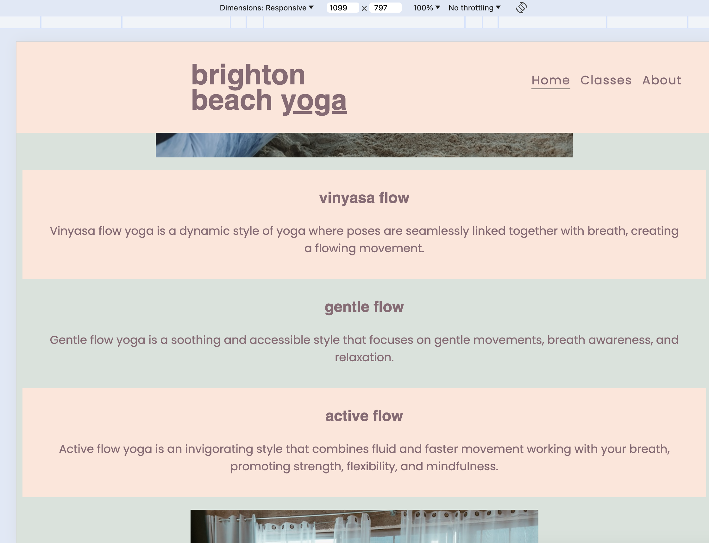
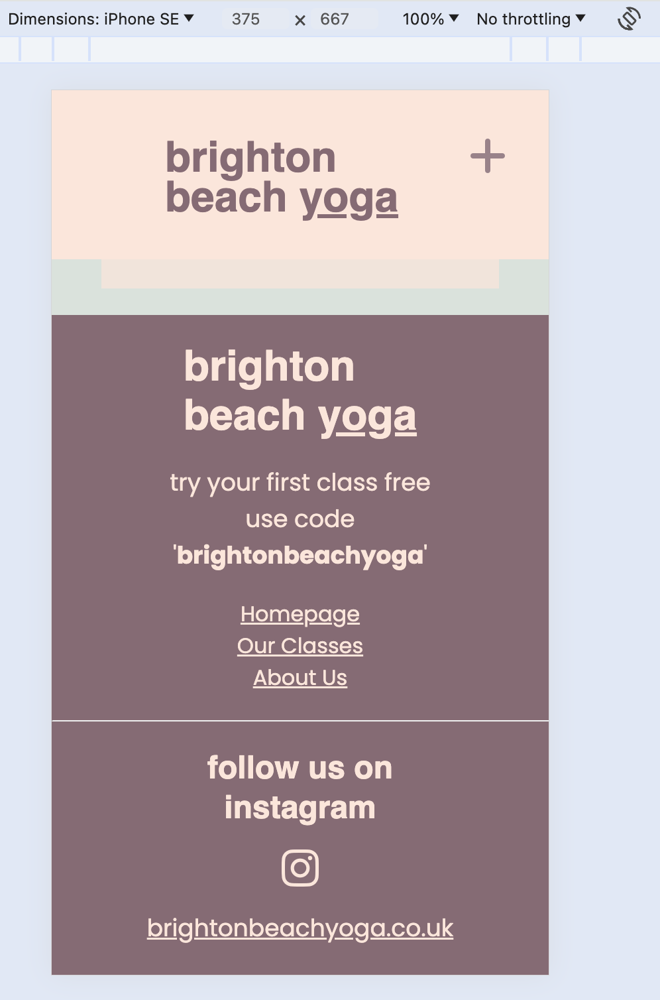
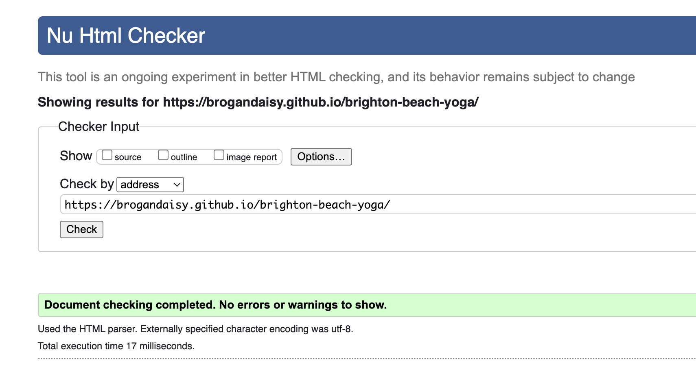
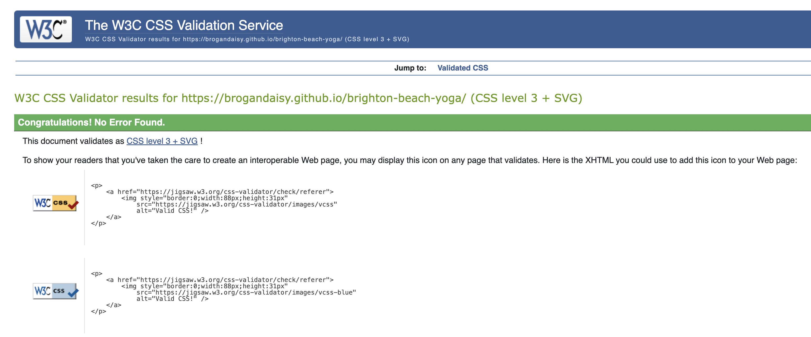

# Brighton Beach Yoga 
Project 1 - Brogan Carpenter

[View live github project](https://github.com/Brogandaisy/brighton-beach-yoga.git)

# brighton beach <ins>yoga</ins>

This project creates a simple, yet effective, website for the 'brighton beach <ins>yoga</ins>' company, offering information on their class range of styles, how to sign up to their monthly newsletter and to find out more information on how the studio started. The website uses their core brand colours, calming images of yoga and the sea with simple and easy to read text.

## About 'brighton beach <ins>yoga</ins>'

The 'brighton beach <ins>yoga</ins>' is a studio based in Brighton, England, on the South East Coast. Created by two founders, living in Brighton, who wanted to bring to life their love of the outdoors and the sea with being mindful and creating movement. The studio has been open since 2019, offering 3 styles of yoga classes right on the beach.

They wanted a new website which held a manageable amount of information for new members to read. They asked for a page for their class offerings and a page on how the studio was created. Plus, a way to sign up to get more information from their monthly newsletter. 

## Table of Contents

1. [UX](#user-experience-ux)
    - [User Stories](###user-stories)
    - [New Members](###new-members)
2. [Design](#design)
    - [Wireframes](###wireframes)
3. Deployment
4. [Features](#features)
5. Testing
    - Browser Testing
    - Code Validation
    - Lighthouse Test
6. Technologies Used
7. Credits and Reference
8. Media

## User Experience UX

### User Stories
The aim for this website was to have a platform where new members can find out more information about 'brighton beach <ins>yoga</ins>'. The studio has brand presence in a prime location, with lots of footfall traffic, however they didn't have an online presence, other than instagram, for new members to discover what they offer.

### New Members
The website has been designed with a primary focus on new members. The website clearly displays the following information in an easy to access format: 
- The styles of classes 'brighton beach <ins>yoga</ins>' has to offer
- The first class free promotion
- How to sign up to get the monthly newsletter
- Descriptions on the styles of classes they offer
- Why the studio was created in 2019

If an non-new member visits the website, they can still get a refresh on what class styles the studio has to offer, and sign up to the newsletter if they haven't already. They can also click to visit their social platforms easily.

## Design
The website has been created across 3 pages, for clear and easy to use seperation of information. The pages have been linked with a simple navigation menu, which adapts to a range of devices for ease of use. 

Each page is simple and follows the brand guidelines, allowing for brand recognition to flow throughout the site. Each sub-page has access back to the homepage.

## Wireframes

## Deployment

## Features
The features for this website were chosen for a simple user experience, allowing the information to be presented easily and accessable to the end user. 

### Navigation Menu
The navigation menu is always at the top of the screen, using the 'brighton beach <ins>yoga</ins>' logo and adjusts to a range of screen sizes. 

- When in mobile, the + icon is used to expand the menu to a drop down menu, to save screen space and create a simple nav system. 

- When using a tablet or desktop, the drop down menu is removed and the menu titles are displayed along the top of the page, as there is more space to use.

### Mobile Nav Bar

### Desktop Nav Bar

### Banner 
On each page a visual banner is used to display the title of the page. The image used on the sub-pages is consistent to provide brand consistency.

The homepage banner is larger to allow for promotions and call to actions to be displayed. The homepage banner adjusts depending on the screen size - on mobile the promotion text banner is fixed to the left side of the screen, and when using a tablet or desktop the banner becomes full width. 
### Banner Mobile

### Banner Desktop

### Why 'brighton beach <ins>yoga</ins>' and Benefits Section
As you scroll down the homepage there is a section for the new member to easily see why they should choose 'brighton beach <ins>yoga</ins>' and the benefits of taking a class at their studio. 

- Small, easy to read paragraphs are used, which adapt in size depending on the screen size. 

- Bullet icons are used in the brand colours, making them stand out and tie in with the branding. 

### Bullet Icons

### Newsletter Sign Up Form
On each page there is a newsletter sign up form, where new or old members can enter their first name, last name and email and select the tick box to start receiving the newsletter to their email inboxes. 

The text input fields are required, allowing the studio to access the key details of the member.

The form is styled using the brand colours and fonts.

### Newsletter Form

### Anchor Links
On each page banner there is a call to action button displayed, which links to the newsletter form on the page they are viewing using an anchor link. This avoids the member scrolling down to the sign up form.

### Class Style Images
On the 'Classes' page, descriptions of each class style are displayed. On mobile view there is an image for each class style, however when using a tablet or desktop the images reduce to just 2 images to allow an easier read for the member and reduce load times for the page.
### Hidden Images for Desktop

### Footer
The footer keeps a consistent style on each page. A contrasting colour is used to stand out and show it is the end of the page easily. The information displayed is easy to read, and find for the member. 

- The logo is displayed
- First class free promotion is repeated
- Navigation links to all the website pages
- Instagram links
- Website link

## Testing
## Browser Testing
I used ['Browser Stack'](https://live.browserstack.com/dashboard#os=Windows&os_version=11&browser=Chrome&browser_version=124.0&zoom_to_fit=true&full_screen=true&url=https%3A%2F%2Fbrogandaisy.github.io%2Fbrighton-beach-yoga%2Fabout.html&speed=1) to test a range of web browswers on desktop and mobile. See an example of tests below.
<table>
  <thead>
    <tr>
      <th>Browser</th>
      <th>Device</th>
      <th>Appearance</th>
      <th>Responsiveness</th>
    </tr>
  </thead>
  <tbody>
    <tr>
      <td>Chrome</td>
      <td>Google Pixel 8 and Desktop Surface 5</td>
      <td>All the pages format correctly. The links, nav and form all work well.</td>
      <td>Responsive design / Very good</td>
    </tr>
    <tr>
       <td>Edge</td>
       <td>iPad 7 and Desktop Macook Pro</td>
      <td>All the pages format correctly. The links, nav and form all work well.</td>
      <td>Responsive design / Very good</td>
    </tr>
    <tr>
      <td>Firefox</td>
      <td>iPhone 15 and Desktop Macbook Air</td>
      <td>All the pages format correctly. The links, nav and form all work well.</td>
      <td>Responsive design / Very good</td>
    </tr>
 
  </tbody>
</table>

## Code Validation
### HTML Validation

## CSS Validation

## Lighthouse Testing
### Lighthouse Mobile - Homepage

